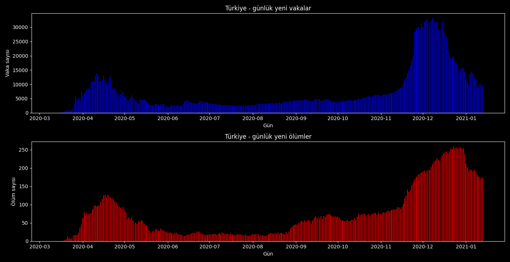

# koronagrafik
PyQt5 ve Matplotlib ile bazı ülkelerin günlük yeni koronavirüs vaka ve ölüm sayılarını gösteren program. 2.0 sürümüyle beraber ülke sayısı artırılmış, güncelleme ve otomatik güncelleme özelliği getirilmiştir.
"hazirla.py" veritabanını oluşturur ve güncelleme seçeneği için hazır hale getirir.

Program verileri https://www.worldometers.info/ adresini kazır. Tarih bilgisini numpy yardımıyla kendisi oluşturur. Bunun için koronavirüsün ülkede görünmeye başladığı tarih veritabanına elle girilmelidir. "hazirla.py" bu işi de üstlenmektedir.

